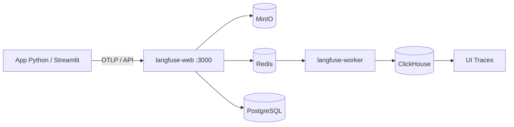

# Configuración de Langfuse — Multi-Agent System

**Última actualización:** Junio 2026

Langfuse es la plataforma de observabilidad LLM usada en este proyecto. Registra trazas de cada consulta: entrada del usuario, recuperación RAG, llamada al modelo y respuesta generada.

---

## Arquitectura

El stack self-hosted de Langfuse requiere **dos servicios principales**:



| Componente | Contenedor | Puerto | Función |
|------------|------------|--------|---------|
| Langfuse Web | `mas-langfuse` | 3000 | UI, login, recepción de traces |
| Langfuse Worker | `mas-langfuse-worker` | — | Procesa cola → escribe en ClickHouse |
| PostgreSQL | `mas-langfuse-db` | 5433 | Usuarios, proyectos, API keys |
| ClickHouse | `mas-langfuse-ch` | 8123 | Traces y observaciones |
| Redis | `mas-langfuse-redis` | 6379 | Cola de ingestión |
| MinIO | `mas-langfuse-minio` | 9000 | Almacén de eventos OTLP |

> **Importante:** Sin `langfuse-worker`, los traces llegan a MinIO pero **no aparecen en la UI**.

---

## Requisitos previos

- Docker Desktop instalado y en ejecución
- Python 3.11+ con entorno virtual (`.venv`)
- Dependencia: `langfuse>=4.0.0` (incluida en `requirements.txt`)

---

## Paso 1 — Levantar la infraestructura

Desde la carpeta `docker/`:

```powershell
cd docker
docker compose up -d
```

Verificar que los contenedores estén activos:

```powershell
docker ps --filter "name=mas-langfuse"
```

Deben aparecer al menos:

- `mas-langfuse`
- `mas-langfuse-worker`
- `mas-langfuse-db`
- `mas-langfuse-ch`
- `mas-langfuse-redis`
- `mas-langfuse-minio`

---

## Paso 2 — Crear cuenta en Langfuse (UI local)

1. Abrir **http://localhost:3000**
2. Ir a **Sign up** (`/auth/sign-up`) — no uses Sign in si es la primera vez
3. Registrar email y contraseña
4. Crear un **proyecto** si el asistente lo solicita

### Credenciales: dos tipos distintos

| Uso | Dónde | Formato |
|-----|-------|---------|
| **Login web** (UI) | Formulario Sign in | Email + contraseña que tú creas |
| **SDK / app Python** | Archivo `.env` | `pk-lf-...` y `sk-lf-...` |

Las API keys **no funcionan** en el formulario de login.

---

## Paso 3 — Obtener API Keys

1. En Langfuse UI → **Settings → API Keys**
2. Crear un par **Public Key** / **Secret Key**
3. Copiar las claves al `.env` del proyecto (raíz)

---

## Paso 4 — Configurar `.env`

En la raíz del proyecto, añadir o editar:

```bash
# Langfuse (observabilidad)
LANGFUSE_HOST=http://localhost:3000
LANGFUSE_PUBLIC_KEY=pk-lf-xxxxxxxx
LANGFUSE_SECRET_KEY=sk-lf-xxxxxxxx
```

**Recomendaciones:**

- Guardar el archivo con **Ctrl+S** antes de probar
- No usar comillas en los valores (opcional, pero evita problemas)
- Reiniciar Streamlit después de cualquier cambio en `.env`

---

## Paso 5 — Ejecutar la aplicación

```powershell
cd ..
.venv\Scripts\activate
pip install -r requirements.txt
streamlit run src/app.py
```

Hacer una consulta en el chat. Luego revisar traces en **http://localhost:3000 → Traces**.

---

## Qué se registra en cada trace

Trace principal: **`multi-agent-query`**

| Elemento | Span en Langfuse | Datos capturados |
|----------|------------------|------------------|
| Entrada del usuario | `orchestrator-route` | `{"prompt": "..."}` |
| Recuperación RAG | `retrieve-context` | Colección, chunks encontrados, errores |
| Embedding (búsqueda) | `openai-embedding` | Modelo, tokens |
| Agente seleccionado | `rag`, `web_research`, `general`, etc. | Nombre y metadata |
| Llamada al LLM | `anthropic-completion` | Modelo, tokens, respuesta completa |
| Respuesta (preview) | `orchestrator-route` | Primeros 500 caracteres |

El `session_id` de Streamlit agrupa mensajes de la misma conversación en la vista **Sessions**.

---

## Integración en el código

| Archivo | Responsabilidad |
|---------|-----------------|
| `src/observability/langfuse_tracing.py` | Cliente, `traced()`, `flush()` |
| `src/config/settings.py` | Carga de variables y env para el SDK |
| `src/orchestrator/router.py` | Spans del pipeline (RAG, clasificación, etc.) |
| `src/agents/base_agent.py` | Generation de Anthropic con tokens |
| `docker/docker-compose.yml` | Servicios Langfuse + worker |

El tracing solo se activa si `LANGFUSE_PUBLIC_KEY` y `LANGFUSE_SECRET_KEY` están definidos.

---

## Verificación rápida

```powershell
# 1. Worker corriendo
docker ps --filter "name=mas-langfuse-worker"

# 2. Traces en ClickHouse (debe ser > 0 tras una consulta)
docker exec mas-langfuse-ch clickhouse-client --host=127.0.0.1 --password=clickhouse --query "SELECT count() FROM traces"

# 3. Health de Langfuse
curl.exe http://localhost:3000/api/public/health
```

---

## Solución de problemas

### Error 401 al iniciar sesión en la UI

- Usar **Sign up** primero si no hay usuarios registrados
- Entrar exactamente con **http://localhost:3000** (no `127.0.0.1` si `NEXTAUTH_URL` usa `localhost`)
- Verificar que `NEXTAUTH_URL` en `docker-compose.yml` coincida con la URL del navegador

### No aparecen traces en la UI

1. Confirmar que `.env` tiene las API keys **guardadas en disco** (no solo en el editor)
2. Reiniciar Streamlit
3. Verificar que **`mas-langfuse-worker`** está corriendo:
   ```powershell
   cd docker
   docker compose up -d langfuse-worker
   ```
4. Ampliar filtro de tiempo en la UI (**Last 7 days** o **All time**)
5. Revisar eventos en MinIO (si hay archivos en `langfuse-events/otel/` pero ClickHouse está vacío → falta worker)

### `tracing enabled: False` en la app

- Las claves en `.env` están vacías o el archivo no se guardó
- Ejecutar la app desde la raíz del proyecto

### Traces enviados pero API lista 0 resultados

- Esperar 10–15 segundos (procesamiento asíncrono del worker)
- Confirmar que el worker no tiene errores: `docker logs mas-langfuse-worker --tail 50`

---

## Compartir Langfuse en la red local (opcional)

Para que un compañero acceda desde la misma Wi‑Fi:

1. Obtener tu IP local: `ipconfig` → IPv4 (ej. `192.168.1.105`)
2. En `docker/docker-compose.yml`, servicio `langfuse`:
   ```yaml
   NEXTAUTH_URL: http://192.168.1.105:3000
   ```
3. Reiniciar:
   ```powershell
   docker compose up -d langfuse langfuse-worker
   ```
4. El compañero abre `http://192.168.1.105:3000` y crea su cuenta
5. Si envía traces desde su máquina, en su `.env`:
   ```bash
   LANGFUSE_HOST=http://192.168.1.105:3000
   ```

Permitir puerto 3000 en el firewall de Windows si es necesario.

> Los datos y cuentas son **locales** a tu instancia Docker. No se sincronizan con [Langfuse Cloud](https://cloud.langfuse.com).

---

## Langfuse Cloud (alternativa)

Para usar la nube en lugar de self-hosted:

```bash
LANGFUSE_HOST=https://cloud.langfuse.com
# o https://us.cloud.langfuse.com
```

Crear cuenta y API keys en la nube. No requiere Docker de Langfuse, pero es un proyecto/instancia **distinto** al local.

---

## Skill de Langfuse para Cursor (opcional)

Instalación del skill oficial para asistencia con tracing:

```powershell
npx skills add langfuse/skills --skill "langfuse"
```

Queda en `.agents/skills/langfuse/` del proyecto.

---

## Referencias

- [Documentación Langfuse](https://langfuse.com/docs)
- [Self-hosting Langfuse](https://langfuse.com/self-hosting)
- [Python SDK — Observability](https://langfuse.com/docs/observability/get-started)
- [CONFIGURACION_APIS.md](./CONFIGURACION_APIS.md) — Anthropic, OpenAI y variables generales
